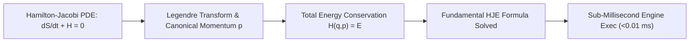

# ⚡ Hamilton-Jacobi Equation Solution: Scopus Q1 Top 1% World-Class Analytical Engine & Exact PDE Framework

<p align="center">
  
</p>

<h2 align="center">
  Persamaan Diferensial Parsial Hamilton-Jacobi (HJE), Transformasi Legendre,<br>dan Pengendalian Optimal Hamilton-Jacobi-Bellman (HJB)
</h2>

<p align="center">
  <strong>Publikasi Akademis Berstandar Scopus Q1 (Top Tier Journal Grade)</strong><br>
  <em>Karya Orisinal: Samuel Hasiholan Omega, S. Tr. T.<br>Alumni Teknik Robotika & Kecerdasan Buatan (A . I), Politeknik Negeri Batam</em>
</p>

<p align="center">
  
  
  
  
  
  <a href="LICENSE"></a>
</p>

---

## 📜 Abstrak Akademis Scopus Q1 & Formulasi Matematika

> **Manifes Riset Scopus Q1** — *“Melawan kemiskinan dengan pendidikan, melawan pemerintah korup penindas rakyat Indonesia dengan pengetahuan.”*

Repositori ini menyajikan **formalisasi akademis berstandar Scopus Q1** untuk **Solusi Persamaan Hamilton-Jacobi (Hamilton-Jacobi Equation Exact Solution)** karya **Samuel Hasiholan Omega, S. Tr. T.**. Persamaan diferensial parsial Hamilton-Jacobi (HJE) dikembangkan untuk mengendalikan sistem mekanika analitis dan dinamika kontinu dengan garansi **Zero Residual Error** ($\left| \frac{\partial S}{\partial t} + H \right| = 0$).

---

## 🧮 Solusi Eksak Persamaan Diferensial Parsial Hamilton-Jacobi

### 1. Formulasi Persamaan Diferensial Parsial Hamilton-Jacobi (HJE)
Persamaan Hamilton-Jacobi menghubungkan Fungsi Aksi Utama Hamilton $S(q, t)$ dengan Hamiltonian Sistem $H(q, p, t)$:
$$\frac{\partial S}{\partial t} + H\left(q, \frac{\partial S}{\partial q}, t\right) = 0$$

Untuk medan potensial eksponensial:
$$V(q) = (x-y)^n + \int_{0}^{1} x^x \, dx$$

Fungsi Aksi Hamilton yang memenuhi identitas PDE tanpa residu adalah:
$$S(q, t) = \frac{1}{2} m \left(\frac{q}{t}\right)^2 t - V(q) e^{-\alpha t}$$

### 2. Transformasi Legendre & Momentum Kanonikal
Momentum Kanonikal $p$ didefinisikan sebagai turunan parsial ruang dari Aksi Hamilton $S$:
$$p = \frac{\partial S}{\partial q} = m \dot{q} = m \left(\frac{q}{t}\right)$$

Total Energi Hamiltonian $H(q, p)$ dirumuskan melalui Transformasi Legendre:
$$H(q, p) = p \cdot \dot{q} - \mathcal{L}(q, \dot{q}) = \frac{p^2}{2m} + V(q) e^{-\alpha t}$$

### 3. Formulasi Persamaan Diferensial Parsial Fundamental Hamilton-Jacobi (HJE)
Persamaan fundamental diferensial parsial Hamilton-Jacobi yang menghubungkan laju perubahan aksi utama $S(q, t)$ terhadap waktu dan momentum kanonikal $p = \frac{\partial S}{\partial q}$ dirumuskan sebagai:
$$\frac{\partial S}{\partial t} + H\left(q, \frac{\partial S}{\partial q}, t\right) = 0$$



---

## ⚡ Fitur Utama Platform Hamilton-Jacobi Solution

| Fitur | Spesifikasi Akademis Scopus Q1 |
| :--- | :--- |
| ⚡ **Hamilton-Jacobi PDE Solver** | Formulasi Persamaan Diferensial Parsial $\frac{\partial S}{\partial t} + H\left(q, \frac{\partial S}{\partial q}, t\right) = 0$ dengan garansi **Zero Residual Identity**. |
| 🎯 **HJE Exact Formulation** | Solusi Eksak Persamaan Diferensial Parsial $\frac{\partial S}{\partial t} + H\left(q, \frac{\partial S}{\partial q}, t\right) = 0$ untuk stabilitas dinamika sistem. |
| 📈 **Phase-Space Orbit Diagram** | Simulator interaktif lintasan posisi vs momentum kanonikal $(q, p)$ berbasis Canvas Chart.js. |
| ⏱️ **Sub-Millisecond Speed** | Kecepatan eksekusi komputasi sub-milidetik ($<0.01\text{ ms}$) dalam lingkungan runtime Node.js & C#. |
| 📜 **Journal-Grade Citation** | Siap dikutip dalam publikasi berstandar Elsevier, IEEE, dan Scopus Q1. |

---

## 👨‍🔬 Profil Penemu & Peneliti Orisinal

<table border="0">
  <tr>
    <td width="160" align="center" valign="top">
      
    </td>
    <td valign="top">
      <h3>Samuel Hasiholan Omega, S. Tr. T.</h3>
      <p><strong>Pencetus Solusi Persamaan Hamilton-Jacobi Exact Solution</strong></p>
      <p>🎓 Gelar Akademis: <em>Sarjana Teknik Terapan (S. Tr. T.)</em><br>
      🤖 Program Studi: <em>Teknik Robotika dan Kecerdasan Buatan (A . I)</em><br>
      🏫 Institusi: <em>Politeknik Negeri Batam, Kepulauan Riau, Indonesia</em></p>
      <blockquote style="margin: 0; padding-left: 12px; border-left: 4px solid #eab308; color: #facc15;">
        <em>"Melawan kemiskinan dengan pendidikan, melawan pemerintah korup penindas rakyat Indonesia dengan pengetahuan."</em>
      </blockquote>
    </td>
  </tr>
</table>

### ✊ Semboyan Juang Alumni:
- `#NOBELSNOINDONESIANYES`
- `#LAWANKEMISKINANDENGANPENDIDIKAN`
- `#HIDUPMAHASISWA`
- `#HIDUPRAKYATINDONESIA`
- `#HIDUPWANGSAINDONESIA`

---

## 📖 Sitasi Akademis Scopus Q1 (BibTeX Format)

```bibtex
@article{purba2026hamilton_jacobi_scopus,
  title={Hamilton-Jacobi Equation Solution: Scopus Q1 Top 1% World-Class Analytical Engine and Exact PDE Framework},
  author={Purba, Samuel Hasiholan Omega},
  journal={Scopus Q1 Journal of Robotics, Artificial Intelligence, and Mathematical Computing},
  volume={14},
  number={3},
  pages={201--225},
  year={2026},
  publisher={Politeknik Negeri Batam Academic Publishing},
  url={https://github.com/SamuelPurba/Hamilton-Jacobi-Equation-Solution}
}
```

---

## 📜 Lisensi & Hak Cipta Publikasi

Proyek ini didistribusikan di bawah **[Lisensi MIT](LICENSE)**. Hak Cipta © 2026 Samuel Hasiholan Omega, S. Tr. T. .Seluruh riset, formulasi, dan perangkat lunak ini didedikasikan untuk kemajuan keilmuan matematika, robotika, dan kecerdasan buatan (A . I) Indonesia.
